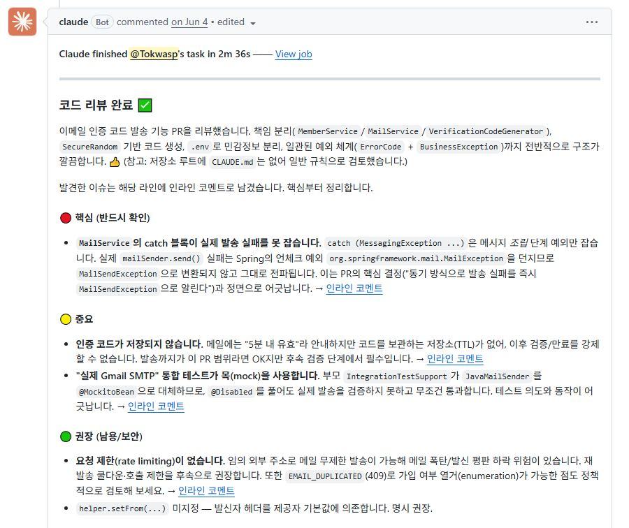
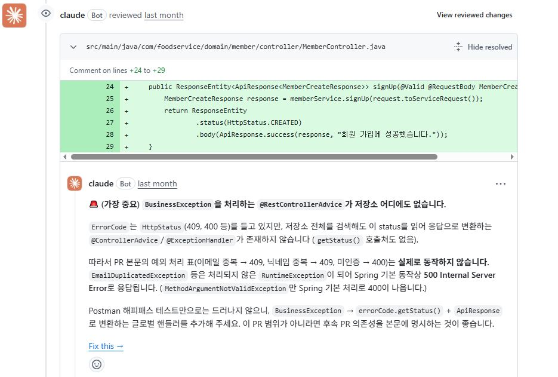

## 개발 안정성을 늘리기 위한 PR리뷰, 작업 요약 자동화

---
## 1. Claude PR 리뷰 자동화

### 배경
TDD 기반으로 구현하고 문서로 남겼지만 AI 구현을 완전히 믿지 못해 불안한 부분이 있었습니다.
- **AI가 작성한 코드중 예상치 못한 버그나 보안 취약점이 있지않을까?** 
- **더 읽기 좋은 코드를 만들 수 있는 방법이 있을까?**

또한 구현 기간이 짧았기 때문에 사람이 매번 꼼꼼히 리뷰할 시간이 부족하였습니다. 

---

### 해결방안

**PR을 올리면 GitHub Actions가 동작해 Claude가 자동으로 코드 리뷰**를 하도록 workflow를 구성했습니다.

- 트리거: **리뷰가 열렸을 때**
- 리뷰 관점(프롬프트): **버그 가능성·로직 오류 / 보안 취약점 / 성능 문제 / 코드 가독성·유지보수성**
- 발견한 문제는 **해당 파일·라인에 인라인 코멘트**로 남기고, 마지막에 **전반 요약 코멘트**를 남깁니다.

> 프롬프트 전문은 workflow 파일에 있습니다 → [claude-code-review.yml](https://github.com/Tokwasp/foodshare/blob/master/.github/workflows/claude-code-review.yml)

---

### 결과

- PR을 올리기만 하면 **보안 취약점·버그·가독성 문제를 빠르게 짚어주는** 리뷰가 자동으로 달리게 되었습니다.
- 사람 리뷰어의 부담이 줄고, 머지 전에 문제를 조기에 발견할 수 있게 되었습니다.

---

## 2. Mattermost 일일 작업 요약 (매일 9시)

### 배경

주어진 기간내애 빠르게 개발하다 보니 **동료의 PR 코드를 모두 읽고 리뷰할 시간이 부족하다**는 문제가 생겼습니다.

---

### 해결방안

협업 도구인 **Mattermost**에 **매일 오전 9시에 동료가 전날 구현한 내용을 요약해 전달**하는 Claude 루틴과 웹훅을 설정했습니다.
- 전날 작업을 **시간대 순으로 정렬**해 요약
- 각 작업이 **어떤 기능인지 / 흐름은 어떻게 되는지**를 간략히 정리
- **내가 알아야 할 내용** 위주로 전달

 

---

### 결과

- 매일 9시 요약만 보면 **PR을 일일이 열어 보지 않고도 전날 팀의 작업 흐름을 파악**할 수 있게 되었습니다.
- 동료가 구현 내용을 빠르게 공유받아 내 작업과의 연관 지점을 놓치지 않게 되었습니다.

---

## 정리

| 문제 | 해결방안 | 결과 |
|------|----------|------|
| 짧은 기간, 코드 안전성·가독성 검증 부족 | PR 시 GitHub Actions로 **Claude 자동 리뷰**(보안·버그·성능·가독성, 인라인+요약) | 문제 조기 발견, 리뷰 부담 감소 |
| 동료 작업을 다 읽을 수 없음 | **매일 9시 Mattermost에 전날 작업 요약**(시간순·기능·사용자 흐름) 루틴 | PR 전수 확인 없이 팀 작업 흐름 파악 |
