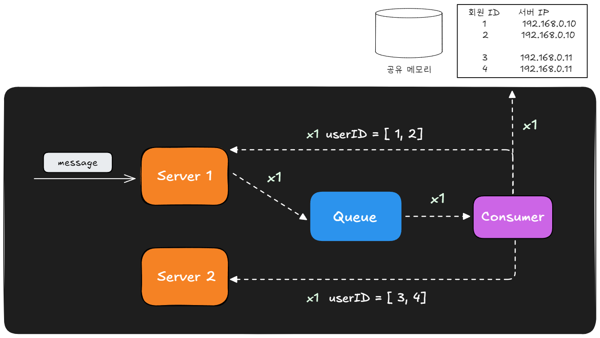

# 다중 인스턴스에서 WebSocket 세션 불일치 문제

## 1. 문제 정의

채팅 실시간 전달 인프라는 ECS로 모놀리식 서버를 2개(이중화)로 띄우고 앞단 ALB가 요청을 두 인스턴스에 분산하는 구조입니다. <BR>
문제는 WebSocket(STOMP) 세션은 회원이 접속한 인스턴스의 인메모리에 존재하여 ALB가 요청을 보내는 인스턴스에 따라 세션 불일치가 생깁니다.


```
A가 보낸 메시지 → ALB → Server 1 요청
B(수신자) 세션  → Server 2에 존재하여 전송 불가능
```

- Server 1 은 자기 인메모리에 B의 세션이 없으므로 로컬 push하면 B는 받지 못합니다.
- 즉 메시지를 처리한 인스턴스와 수신자 세션을 가진 인스턴스가 다르다라는 문제가 발생하고 이를 세션 불일치라고 합니다.

---
## 2. 대안 비교

| 대안 | 방식 | 특징 |
|------|------|------|
| Redis Pub/Sub 팬아웃 | 단일 채널에 publish → **모든 인스턴스**가 수신 → 로컬 세션 가진 쪽만 전달 | 단순·의존성 0(세션용 Redis 재사용). 모든 인스턴스가 모든 메시지를 받는 비용 |
| 메시징 큐(directed routing) | presence(`userId→serverId`) 조회 후 **수신자가 붙은 서버에만** 전달 | 팬아웃 낭비 없음·내구성/재처리 가능. presence·워커·DLX 운영 부담 |

## 4. 선택 — Redis Pub/Sub 단일 채널 팬아웃

**제약을 고려해 Redis Pub/Sub를 선택했다.**

- 지금은 **모놀리식 서버를 이중화**한 것뿐이라, MSA처럼 모듈이 분리된 상황이 아니다.
- **1:1 채팅방만** 사용한다(방당 수신자 1명).
- **2주 안에 전체 구현**을 끝내야 한다.
- Redis는 이미 Spring Session으로 쓰고 있어 **새 의존성이 0**이다.

**동작 흐름**

1. 메시지는 먼저 **DB에 저장(정본)** 한다. 실시간 전달은 그 위의 best-effort.
2. 발행 인스턴스가 `(payload, recipientIds)`를 Redis 단일 채널 `chat.messages`에 **publish**.
3. **모든 인스턴스**가 그 채널을 구독 중 → 메시지를 받는다.
4. 각 인스턴스가 `recipientIds`에 대해 `convertAndSendToUser`를 호출 →
   수신자 세션을 **로컬에 가진 인스턴스만** 실제 전달하고, 나머지는 **자동 no-op**.

세션이 어디 붙었는지 우리가 추적할 필요가 없다(Spring user 레지스트리가 인스턴스별로 자동 판정).
수신자가 오프라인이라 어디에도 세션이 없으면 모두 no-op으로 흘려보내고,
수신자는 재접속 후 **이력/`unread` 조회**로 확인한다(메시지는 DB 정본이라 유실 아님).

## 5. 그럼 언제 메시징 큐가 필요한가

**다중(그룹) 채팅**이나 **비로그인/오프라인 알람**이 필요해지면 이야기가 달라진다.
다만 여기서 흔히 섞이는 개념 하나를 먼저 정리한다.

### 5-1. pub/sub 토폴로지의 함정 (구독 단위를 잘못 잡으면)

- **userId 단위 구독**(회원마다 채널): 방에 메시지를 뿌리려면 **방 인원수만큼 발행**해야 한다(N번 publish).
- **room 단위 구독**(방마다 채널): WebSocket이 **연결/재연결될 때마다** 그 회원이 속한 **모든 방을 구독**해야 한다.

> 참고: 우리가 쓰는 **단일 채널 브로드캐스트 + 로컬 세션 필터**는 위 두 함정을 **모두 회피**한다.
> (구독 단위가 방도 회원도 아닌 "인스턴스 1개당 채널 1개"이기 때문.) 소규모에선 이게 가장 단순하다.
> 대신 "모든 인스턴스가 모든 메시지를 받는" 비용이 있고, 트래픽이 커지면 이게 부담이 된다.

### 5-2. 서버 단위 그룹핑 (directed routing)

트래픽이 커지면, **공유 메모리**에 **`회원 id → 서버 ip`** 를 저장해 두고,
Consumer가 전달할 `userIds` 리스트를 받았을 때 공유 메모리를 조회해 **서버 단위로 그룹핑**하면 낭비를 줄일 수 있다.



> message → Server 1 → Queue → Consumer. Consumer가 공유 메모리에서 `회원ID → 서버IP`(1·2 → 192.168.0.10, 3·4 → 192.168.0.11)를 확인한 뒤,
> Server 1 로 `userID=[1,2]` 1회, Server 2 로 `userID=[3,4]` 1회로 묶어 보낸다. 각 서버는 자기 세션 보유 회원에게만 push → **서버당 1회로 최적화**.

```
메시지 대상 userIds: [1, 2, 3, 4]
공유 메모리:  1,2 → Server 1     3,4 → Server 2

→ Server 1 로 1회 (대상 1,2)
→ Server 2 로 1회 (대상 3,4)     // 서버당 1회로 최적화
```

> ⚠️ **정정 포인트**: 이 "서버 단위 그룹핑" 최적화는 **메시징 큐만의 기능이 아니다.**
> Redis Pub/Sub로도 **서버별 채널**(`chat.routing.{serverId}`) + presence 해시를 두면 똑같이 "서버당 1회"가 된다.
> 즉 *그룹핑 최적화*와 *pub/sub냐 MQ냐*는 **서로 다른 축**이다.

### 5-3. 그렇다면 메시징 큐의 진짜 차별점은

- **내구성(durability) / at-least-once**: Pub/Sub은 **구독자가 없으면 메시지를 그냥 버린다**(fire-and-forget).
  **비로그인/오프라인 알람**은 "지금 접속 안 한 사람에게 나중에 전달"이 핵심이라, 메시지가 큐에 **남아 있어야** 한다.
  → 여기가 메시징 큐(또는 지속 큐)가 **필수가 되는 지점**이다.
- **워커 경쟁 소비 / 백프레셔 / DLX(재처리)**: 대규모 팬아웃을 워커 풀이 자기 속도로 처리하고, 크래시 시 재평가·재전달.

**정리하면**
- **그룹 채팅 팬아웃 효율** → presence 기반 **directed routing** 문제 (Pub/Sub로도 해결 가능, MQ는 대규모에서 이득)
- **비로그인 알람** → **내구성** 문제 → **메시징 큐가 필요**

## 6. 정리

| 상황 | 선택 | 근거 |
|------|------|------|
| **현재** (모놀리식 이중화 · 1:1 · 2주) | **Redis Pub/Sub 단일 채널 팬아웃** | 단순, 새 의존성 0, 구독 토폴로지 함정 회피. 소규모에 최적 |
| 그룹 채팅으로 확장 | presence + **directed routing** | 브로드캐스트 낭비 제거. Pub/Sub(서버별 채널)로도, MQ로도 가능 |
| 비로그인/오프라인 알람 | **메시징 큐(지속 큐)** | Pub/Sub은 구독자 없으면 유실 → 내구성 필요. 워커/DLX로 재처리 |

- **문제**: ECS 이중화 + ALB 라우팅 → 발신 처리 인스턴스와 수신자 세션 보유 인스턴스가 달라 세션 불일치.
- **선택**: Redis Pub/Sub 단일 채널 팬아웃 + 로컬 세션 필터. DB가 정본이라 실시간은 best-effort.
- **확장**: 그룹 채팅=directed routing(pub/sub로도 가능), 오프라인 알람=내구성 필요→메시징 큐.
