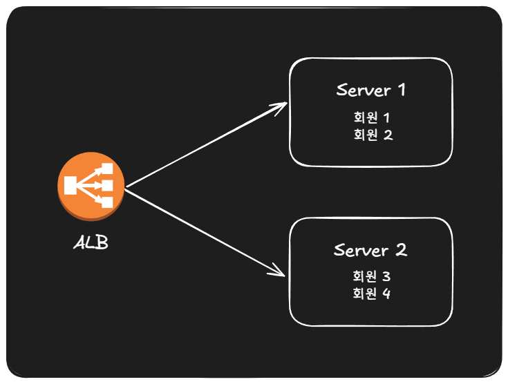

# 다중 인스턴스에서 WebSocket 세션 불일치 문제

## 1. 문제 정의

채팅 실시간 전달 인프라는 ECS로 모놀리식 서버를 2개(이중화)로 띄우고 앞단 ALB가 요청을 두 인스턴스에 분산하는 구조입니다. <BR>
문제는 WebSocket(STOMP) 세션은 회원이 접속한 인스턴스의 인메모리에 존재하여 ALB가 요청을 보내는 인스턴스에 따라 세션 불일치가 생깁니다.



```
Server 1이 요청을 받고 회원3에게 메세지를 전송할 경우
회원3(수신자) 세션  → Server 2존재하여 전송 불가능한 상황 발생
```

- Server 1 은 자기 인메모리에 회원3의 세션이 없으므로 로컬 push하면 회원3은 받지 못합니다.
- 즉 메시지를 처리한 인스턴스와 수신자 세션을 가진 인스턴스가 다른 문제가 발생하고 이를 세션 불일치라고 합니다.

---
## 2. 대안 비교

| 대안 | 방식 | 특징 |
|------|------|------|
| Redis Pub/Sub | 단일 채널에 publish → 모든 인스턴스 수신 → 로컬 세션 가진 쪽만 전달 | 인프라 추가X |
| Message Queue | 공유 메모리 조회 후 수신자 서버에만 전달 | 팬아웃 낭비 없음, 추가 인프라 필요O |
| 인스턴스간 직접 포워딩 | 서버1에 수신자 세션이 없으면 서버2 직접 포워딩 | 별도 인프라 X, 스케일 아웃 시 인스턴스 의존성이 강해져 확장에 불리 |

---
## 3. 선택 — Redis Pub/Sub 단일 채널 팬아웃
- 현재 1:1 채팅 사용 가능 / 1:N 채팅 방 확장 가능
- 2-3주 짧은 구현 기간으로 인한 러닝커브가 존재하는 메세징 큐 공부, 구현 시간이 부족
- Redis는 이미 Spring Session으로 쓰고 있기 때문에 의존성을 추가X

## 3-1. 구독 유형
- **userId 단위 구독**: 채팅 방에 메시지 발행 시 채팅 인원 수만큼 메시지 발행으로 인한 비효율 발생 가능
- **room 단위 구독**: WebSocket 연결/재 연결될 때마다 그 회원이 속한 모든 방을 구독 ( DB 조회 )으로 인한 비효율 발생 가능
- **단일 토픽 구독**: 모든 인스턴스가 메시지 1회 수신 <br>
- userId, room 구독은 비효율적인 측면이 있다고 생각하여 단일 토픽 구독 선택

## 3-2 메시징 큐 필요한 경우
- 비 로그인 / 오프라인 알람이 필요한 경우

---
## 4. 정리

| 상황 | 선택 | 근거 |
|------|------|------|
| 모놀리식 이중화 | **Redis Pub/Sub 단일 채널 팬아웃** | 단순, 의존성 추가X, 소규모에 최적 |
| 비로그인/오프라인 알람 | **메시징 큐** | Pub/Sub은 구독자 없으면 유실 → 내구성 필요. 워커/DLX로 재처리 |

- **문제**: ECS 이중화 + ALB 라우팅 → 발신 처리 인스턴스와 수신자 세션 보유 인스턴스가 달라 세션 불일치.
- **선택**: Redis Pub/Sub 단일 채널 팬아웃
- **확장**: 그룹 채팅=directed routing(pub/sub로도 가능), 오프라인 알람=내구성 필요→메시징 큐.
