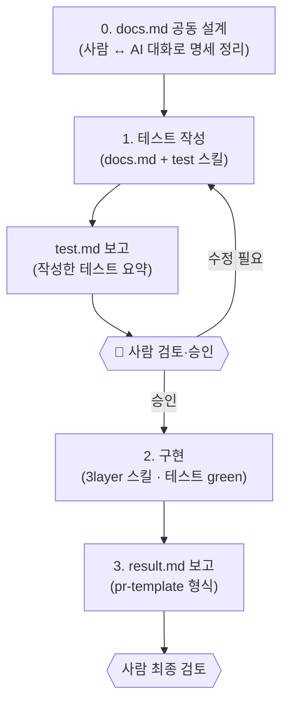

# AI 개발 워크플로에 Human-in-the-Loop 적용하기

> 관련: [`implement` 스킬](../skills/implement/SKILL.md) · 산출물 예시 [`docs/chat-room/`](../docs/chat-room)

---

## 배경

AI에게 작업을 맡기면 작업이 예상치 못한 방향으로 흘러가거나 명세를 벗어나 품질을 보장하기 어려운 문제가 생깁니다.  
그래서 TDD를 기반으로 명세를 최대한 지키도록 다음 순서를 나눠 순차적으로 진행했습니다.

1. **테스트 코드 작성** (`.claude/test` 스킬) → 개발자가 테스트 코드 검토
2. **구현** (`.claude/3layer` 스킬) → 테스트를 모두 통과하도록 3-layer 구현
3. **개발자가 구현 결과 검토**

이 과정이 매 작업마다 반복되어 커맨드 슬래시( implement )로 만들어 워크플로를 자동화하였습니다.   
또한 구현 문서(`docs.md`), 테스트 결과(`test.md`), 구현 결과(`result.md`)로 작업 히스토리를 남겨 차후 수정·확장에 도움되도록 하였습니다.

---
## 스킬 흐름
프로젝트 루트 [API 명세서](/CLAUDE.md)를 통해 AI와 대화하여 `docs/{도메인}/docs.md`( 구현 상세 명세 )를 작성한 뒤 커맨드 슬래쉬를 사용합니다.  
그 다음 `implement` 스킬에 도메인 이름을 파라미터로 주면 아래 흐름이 돌아갑니다.  
ex) /implement chat-room

**0. 구현 설계** — API 명세서를 토대로 AI와 대화하며 `docs/{도메인}/docs.md`에 구현 로직을 정리합니다.   
**1. 테스트 작성 및 보고** — 구현 문서 `docs.md` + [`test` 스킬](../skills/test)를 참고해 테스트 코드를 작성하고 작성한 테스트를 요약해 `test.md`로 보고합니다.   
**🚦 검토 게이트** — 사람이 테스트 문서 (`test.md`)를 검토해 문제가 없으면 구현을 승인하고 고칠 게 있으면 이 단계 안에서 반복합니다.   
**2. 구현** — [`3layer` 스킬](../skills/3layer)를 통해 각 레이어를 구현하고 모든 테스트가 통과될 때까지 반복합니다.   
**3. 결과 보고** — [`pr-template` 스킬](../skills/pr-template/SKILL.md) PR 형식으로 구현·테스트 내용을 `result.md`에 정리합니다. 사람은 이 PR 형식 보고로 최종 검토합니다.

---

## 장점

- **명세 이탈 방지 :** API 명세를 바탕으로 구현 로직을 사람이 확정하므로 AI가 명세 밖으로 벗어나지 않습니다.
- **TDD를 통한 환각 방지 :** 테스트를 토대로 구현하기때문에 문맥을 잘못 이해하여 발생하는 환각을 방지할 수 있습니다.
- **산출물 문서화 :** `docs/{도메인}/` 아래에 `docs.md`(명세) → `test.md`(테스트 보고) → `result.md`(최종 보고)로 남아 수정·확장에 유리합니다.
---

## 산출물 예시 (chat-room 도메인)

한 도메인이 이 워크플로를 거치면 아래 세 파일이 순서대로 남습니다.

| 단계 | 파일 | 역할 |
|------|------|------|
| 입력(설계) | [`docs/chat-room/docs.md`](../docs/chat-room/docs.md) | 사람 ↔ AI가 정리한 아키텍처·로직 명세 |
| 게이트 산출물 | [`docs/chat-room/test.md`](../docs/chat-room/test.md) | 작성한 테스트 요약 (사람이 검토·승인하는 대상) |
| 최종 보고 | [`docs/chat-room/result.md`](../docs/chat-room/result.md) | PR 형식의 구현 결과 보고 |
