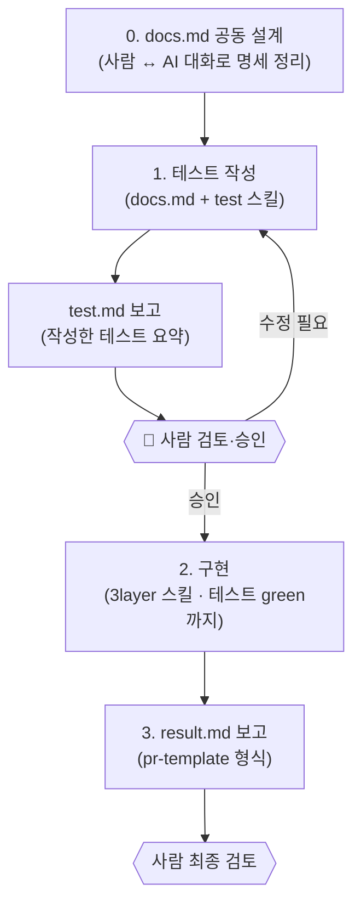

# AI 개발 워크플로에 Human-in-the-Loop 적용하기

> 관련: [`implement` 스킬](../skills/implement/SKILL.md) · 산출물 예시 [`docs/chat-room/`](../docs/chat-room)
>
> AI에게 개발을 맡기되 **핵심 결정 지점마다 사람이 검토·승인**하도록 워크플로를 설계했습니다.

---

## 배경

작업은 매번 **TDD** 기반으로 진행했습니다. 즉 *테스트를 짜고 → 확인하고 → 구현하고* 를 반복했습니다.  
여기에 2~3주라는 짧은 기간을 메우기 위해 AI를 적극적으로 활용했는데 두 가지가 고민이었습니다.

- AI에게 **한 번에 끝까지 자율로** 맡기면, 합의하지 않은 방향으로 **명세를 이탈**하거나 결과물 품질이 들쭉날쭉할 수 있습니다.
- 그렇다고 매번 사람이 모두 검토할 경우 AI의 생산성을 효율적으로 활용할 수 없었습니다.

그래서 **AI 작업에 안정성과 구조**가 필요했고 그 답으로 **Human-in-the-Loop**를 택했습니다.

---

## 전체 흐름

로직은 구현할 내용을 먼저 AI와 대화하며 `docs/{도메인}/docs.md`(아키텍처·구현 로직 명세)로 정리해 둔 뒤 시작합니다.  
그 다음 `implement` 스킬에 **도메인 이름**을 파라미터로 주면 아래 흐름이 돌아갑니다.

**0. 명세 공동 설계** — 무엇을 만들지 AI와 대화하며 `docs/{도메인}/docs.md`에 아키텍처·로직을 정리합니다.

**1. 테스트 작성 및 보고** — `docs.md` + [`test` 스킬](../skills/test)을 참고해 테스트 코드를 작성하고 작성한 테스트를 요약해 `test.md`로 보고합니다.

**🚦 검토 게이트** — 사람이 `test.md`를 검토해 문제가 없으면 "구현 들어가"로 승인하고, 고칠 게 있으면 이 단계 안에서 반복합니다.

**2. 구현** — 승인을 받은 뒤에만 시작합니다. [`3layer` 스킬](../skills/3layer)의 레이어별 구현 가이드에 따라 구현하고 
1단계의 테스트가 **모두 통과(green)** 할 때까지 반복합니다. 구현 중에는 멈춰 다시 묻지 않고 끝까지 완료합니다.

**3. 결과 보고** — [`pr-template` 스킬](../skills/pr-template/SKILL.md) 형식으로 구현·테스트 내용을 `result.md`에 정리합니다. 사람은 이 PR 형식 보고로 최종 검토합니다.

---

## 왜 안정적이고 구조적인가

- **명세 이탈을 막습니다.** 구현 전에 "무엇을 검증할지(테스트)"를 사람이 확정하므로 AI가 명세 밖으로 벗어나지 않습니다.
- **TDD 테스트는 가드레일입니다.** 서로 합의된 테스트가 green이 되는 것이 완료 기준이기 때문에 사람이 개입하지 않아도 방향이 보장됩니다.
- **레이어가 분리되어 있습니다.** 테스트·구현 모두 레이어별 스킬(`test/`, `3layer/`)을 따르고, `implement` 스킬은 **순서와 명세만** 책임집니다.
- **산출물이 표준화됩니다.** 모든 단계가 `docs/{도메인}/` 아래에 `docs.md`(명세) → `test.md`(테스트 보고) → `result.md`(최종 보고)로 남아, 나중에 흐름을 재현하고 리뷰하기 쉽습니다.
---

## 산출물 예시 (chat-room 도메인)

한 도메인이 이 워크플로를 거치면 아래 세 파일이 순서대로 남습니다.

| 단계 | 파일 | 역할 |
|------|------|------|
| 입력(설계) | [`docs/chat-room/docs.md`](../docs/chat-room/docs.md) | 사람 ↔ AI가 정리한 아키텍처·로직 명세 |
| 게이트 산출물 | [`docs/chat-room/test.md`](../docs/chat-room/test.md) | 작성한 테스트 요약 (사람이 검토·승인하는 대상) |
| 최종 보고 | [`docs/chat-room/result.md`](../docs/chat-room/result.md) | PR 형식의 구현 결과 보고 |
