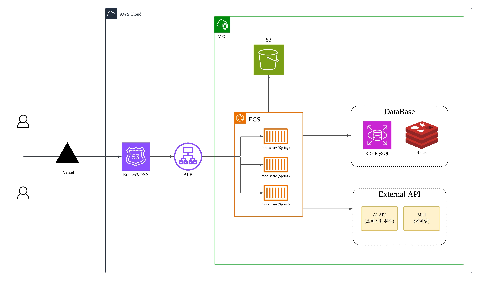

# 🥗 Food-Share — AI 소비기한 인식 음식 나눔 서비스

> 남는 가공·미개봉 식품을 이웃과 나누되, **소비기한을 AI로 인식**해 안전하게 나누는 서비스입니다.

---

## 📌 기획 배경

기존 당근마켓 등의 나눔 서비스에서도 가공식품을 나눌 수 있지만, **소비기한이 명확하게 표기되지 않아**
받는 사람이 상태를 알기 어렵고 **식중독 등 안전 문제**가 발생할 수 있습니다.

Food-Share는 음식을 나눔할 때 **소비기한 사진을 AI가 인식**해 등록 물품에 소비기한을 명시함으로써,
받는 사람이 안심하고 나눔받을 수 있도록 이 문제를 해결하고자 했습니다.

---

## 🛠️ 기술 스택

**Frontend** ([FE 저장소](https://github.com/foodsharedservice/foodsharedservice_FE))
- Next.js 14 (App Router), React 18, JavaScript
- Custom CSS (design tokens), Pretendard
- Vercel 배포

**Backend**
- Java 17, Spring Boot 4.0.6
- Spring Data JPA, MySQL / H2(test)
- Redis (Spring Session, Pub/Sub), WebSocket + STOMP
- Spring Security Crypto (비밀번호 해싱), Spring Mail (이메일 인증)
- 생성형 AI (Gemini / Claude) — 소비기한 인식

**Infra**
- AWS ECS, ALB, Route53, RDS(MySQL), S3, Redis
- Docker

---

## 🏗️ 시스템 아키텍처



- **Frontend**: Vercel 배포
- **Routing**: Route53(DNS) → ALB → **ECS(food-share Spring)** 다중 인스턴스
- **Storage**: 이미지 → **S3**, 데이터 → **RDS MySQL**, 세션·실시간 중계 → **Redis**
- **External API**: 소비기한 분석(AI), 메일 발송
- 전체 리소스는 AWS **VPC** 내에 구성

---

## 📄 트러블슈팅 / 문서

- **API 명세**: [`CLAUDE.md`](./CLAUDE.md) — 전체 REST/WebSocket API 명세 (v3)
- **트러블슈팅 노트**: [`.claude/troubleshooting/`](./.claude/troubleshooting)
  - [AI 개발 워크플로에 Human-in-the-Loop 적용하기 (implement 스킬)](./.claude/troubleshooting/skill-human-in-the-loop.md)
  - [개발 안정성을 늘리기 위한 AI 자동화 (PR 리뷰·작업 요약)](./.claude/troubleshooting/AI-automation.md)
  - [채팅 다중 인스턴스 세션 불일치와 Redis Pub/Sub 선택](./.claude/troubleshooting/chat-session-mismatch.md)
  - [이메일 전송에 트랜잭션을 적용하지 않은 이유](./.claude/troubleshooting/email-send-no-transaction.md)
  - [이메일 전송 타임아웃(5초) 검증 방법](./.claude/troubleshooting/email-send-timeout-test.md)

---

## 주요 기능

- **회원** — 이메일 인증 회원가입, 세션 로그인(Redis), 회원 정보 관리
- **소비기한 인식(GMS)** — 사진 업로드 시 생성형 AI(Gemini / Claude)가 소비기한 인식
- **나눔 물품** — 물품 등록/조회/수정/삭제, 소비기한 만료 배치
- **나눔 요청** — 요청 → 등록자 수락/거절, 정원 충족 시 완료 처리
- **채팅** — 등록자 ↔ 요청자 1:1 실시간 채팅(WebSocket/STOMP + Redis Pub/Sub), 안읽음 수·양방향 커서 이력

---

## 🎬 시연 영상

▶️ **[시연 영상 보기 (Google Drive)](https://drive.google.com/file/d/1RMWxMZep0eR5cXDDXmanNvZPn2WEDQmK/view?usp=sharing)**

---

## 👤 담당 역할

**백엔드 2명**으로 진행했으며, 그중 아래 영역을 담당했습니다.

- **Frontend** — 화면 구현
- **Backend** — **회원(member)**, **채팅(chat)** 도메인
- **Infra** — AWS(ECS/ALB/Route53/RDS/S3/Redis) 인프라 구성 및 배포

> 프로젝트 기간: **약 2주** · 팀 구성: **백엔드 2명**

---

## 📦 패키지 구조 (도메인형)

```
com.foodservice
├── common          # 공통 (예외/설정/응답 포맷 등)
└── domain
    ├── member       # 회원, 이메일 인증, 로그인/세션
    ├── food         # 나눔 물품, AI 소비기한 인식(client), 만료 배치(scheduler)
    ├── foodrequest  # 나눔 요청 (수락/거절)
    ├── image        # 이미지 저장/삭제 (S3 store)
    └── chat         # 1:1 채팅 (WebSocket/STOMP, Redis Pub/Sub broadcast)
```

각 도메인은 `controller · service · repository · entity · dto` 로 구성된 **도메인 중심 패키지 구조**를 따릅니다.
